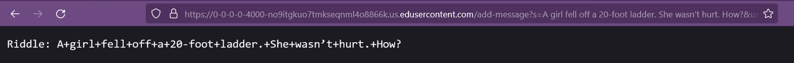
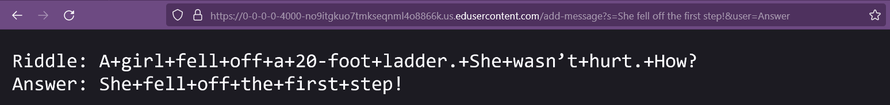
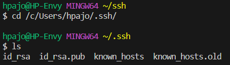
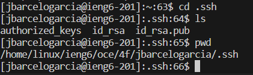
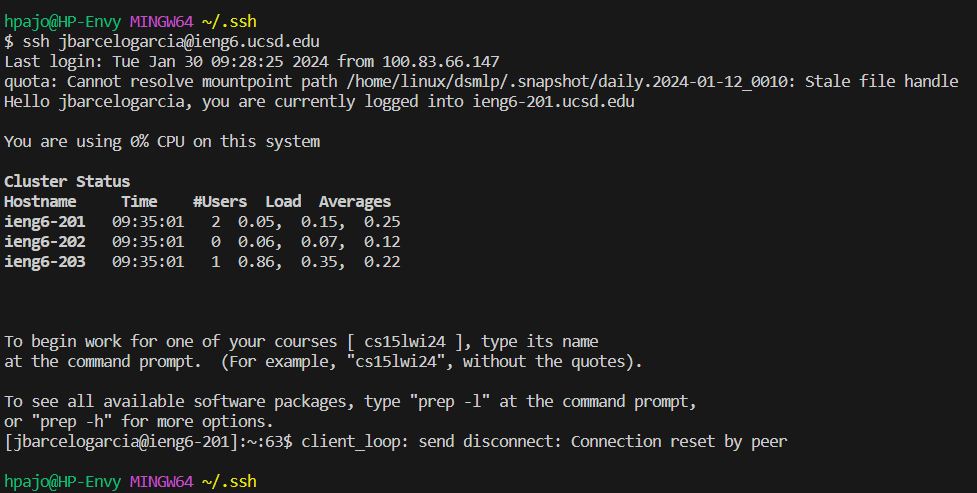

# **Lab Report 1**

## 1. Web Server **ChatServer**

### ChatServer.java code
```
import java.io.IOException;
import java.net.URI;

class ChatServer {
    public static void main(String[] args) throws IOException {
        if(args.length == 0){
            System.out.println("Missing port number! Try any number between 1024 to 49151");
            return;
        }

        int port = Integer.parseInt(args[0]);

        Server.start(port, new Handler());
    }
}

class Handler implements URLHandler {
    // The one bit of state on the server: a number that will be manipulated by
    // various requests.
    String history = "";
    String s = "";
    String u = "";

    public String handleRequest(URI url) {
        if (url.getPath().equals("/")) {
            if(history.equals("")) return "Chat history is empty!";
            else return history;
        } else if (url.getPath().equals("/add-message")) {
            String[] parameters = url.getQuery().split("&");
            String[] message = parameters[0].split("=");
            String[] user = parameters[1].split("=");
            if (message[0].equals("s")) {
                s = message[1];
                s.replace("+", " ");
            }
            if (user[0].equals("user")) {
                u = user[1];
                u.replace("+", " ");
            }
            history += u + ": " + s + "\n";
            return history;
        }else if(url.getPath().equals("/clear")){
            history = "";
            return "Chat history has been cleared!";
        }else{
            return "404 not found!";
        }
    }
}
```
### First instance of **/add-message**
URL[^1].


- Methods Called:

>`main`: The class `chatServer` has no fields that affect this method but it takes in the command line as arguments. It takes in a number to be used as a port number with the following method.
>
>`handleRequest`: This method has three String fields within the class `Handler`; `history`-Stores the chat history, `s`-Temporarily stores the intended message, `u`-Temporarily stores the user sending the message. The method takes in a URL and does something different depending on the path.

- With this specific request, the following changes happen to the fields:
  1. `String s` now stores "A girl fell off a 20-foot ladder. She wasn’t hurt. How?"
  2. `String u` now stores "Riddle"
  3. `String history` now stores the combination of `u + ": " + s`

### Second instance of **/add-message**
URL[^2].


- Methods Called:

>`main`: Refer to the previous image
>
>`handleRequest`: refer to the previous image

- With this specific request, the following changes happen to the fields:
  1. `String s` now stores "She fell off the first step!"
  2. `String u` now stores "Answer"
  3. `String history` now stores the combination of `u + ": " + s`


## 2. Key Login

### Absolute path to private key


### Absolute path to public key


### Terminal login



## 3. Stuff I learnt

### a) Launch a java webserver

Whilst I am sure that a good amount of the work is done internally with the UCSD servers, I loved seeing how simple it seems to launch a server as long as you connect to an appropriate port. This includes how the URL is comprised of the protocol, subdomain, doman, path, query, and the parameters!

### b) Setting up Junit

The tutorial videa helped me set up Junit and utilize it from my terminal for my CSE 12 PA to run some autograders that check on style and indentations. It saved me a lot of time from figuring out what commands to run and how to sort the files.


[^1]: https://0-0-0-0-4000-no9itgkuo7tmkseqnml4o8866k.us.edusercontent.com/add-message?s=A girl fell off a 20-foot ladder. She wasn’t hurt. How?&user=Riddle

[^2]: https://0-0-0-0-4000-no9itgkuo7tmkseqnml4o8866k.us.edusercontent.com/add-message?s=She fell off the first step!&user=Answer
