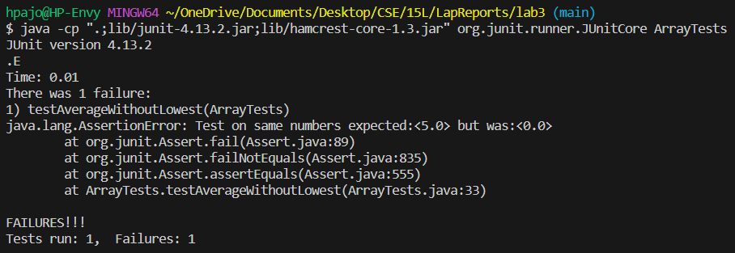

# **Lab Report 2**

## 1. Bugs

### averageWithoutLowest(doube[] arr)
```
static double averageWithoutLowest(double[] arr) {
    if(arr.length < 2) { return 0.0; }
    double lowest = arr[0];
    for(double num: arr) {
      if(num < lowest) { lowest = num; }
    }
    double sum = 0;
    for(double num: arr) {
      if(num != lowest) { sum += num; }
    }
    return sum / (arr.length - 1);
}
```
#### **Failure Inducing**
Input: {5, 5, 5}
```
@Test
public void testAverageWithoutLowest(){
    double[] input2 = {5, 5, 5};
    assertEquals("Testing same number", 5, ArrayExamples.averageWithoutLowest(input2), 0.001);
}
```
Expect: 5, Output: 0


#### **Non-Failure Inducing**
Input: {1, 2, 3}
```
@Test
public void testAverageWithoutLowest(){
    double[] input1 = {1, 2, 3};
    assertEquals(3, ArrayExamples.averageWithoutLowest(input1), 0.001);
}
```
Expect: 2.5, Output: 2.5

#### **Symptom**

> The test with input {1, 2, 3} passes and is the first "." in the terminal output
> 
> The test with input {5, 5, 5} is the failure, resulting in the "E" and the rest of the terminal output

#### Fixing the Bug
```
/**
* Bug: Does not check for a null array input
* Bug: Input being of all same number
*/
static double averageWithoutLowest(double[] arr) {
    if(arr.length < 2) { return 0.0; }
    double lowest = arr[0];
    for(double num: arr) {
      if(num < lowest) { lowest = num; }
    }
    double sum = 0;
    for(double num: arr) {
      if(num != lowest) { sum += num; }
    }
    return sum / (arr.length - 1);
  }
```


## 3. Stuff I learnt

### a) Launch a java webserver

Whilst I am sure that a good amount of the work is done internally with the UCSD servers, I loved seeing how simple it seems to launch a server as long as you connect to an appropriate port. This includes how the URL is comprised of the protocol, subdomain, doman, path, query, and the parameters!

### b) Setting up Junit

The tutorial videa helped me set up Junit and utilize it from my terminal for my CSE 12 PA to run some autograders that check on style and indentations. It saved me a lot of time from figuring out what commands to run and how to sort the files.
