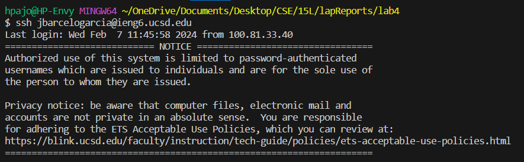
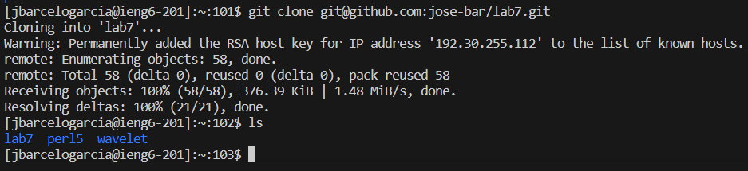
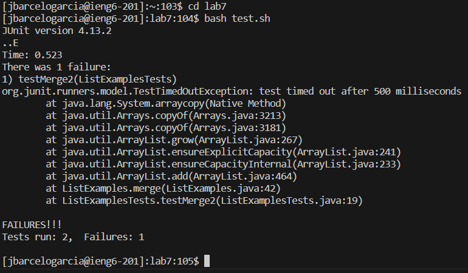
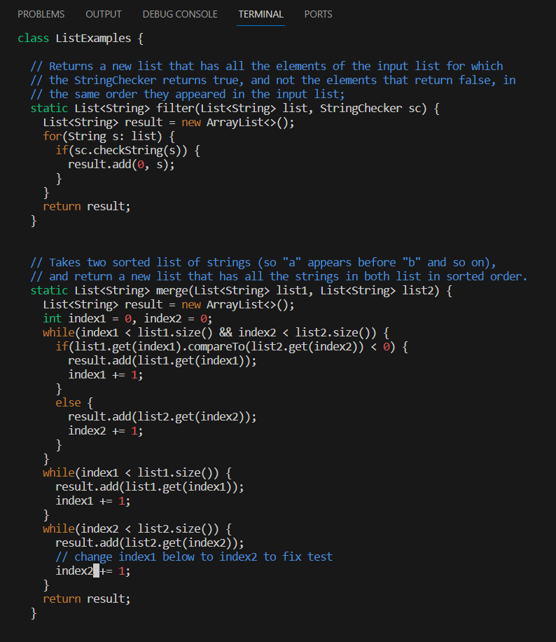
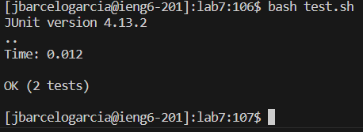

# **Lab Report 4**

## Step 4: Log into ieng6

> Keys Pressed: `s s h <space> j b a r c e l o g a r c i a @ i e n g 6 . u c s d . e d u <enter>`

I ran the `ssh` command which allows me to connect my device to the ieng6 server. You specify the server after the `@` key and you specify the user before the `@`. 

## Step 5: Clone your fork of the repository from your Github account (using the SSH URL)

> Keys Pressed: `g i t <space> c l o n e <space> <ctrl> v <enter> l s <enter>`

I ran the `git clone` commands which makes a copy of the specified git resposatory in a new directory. I specified the `ssh` key git@github.com:jose-bar/lab7.git using `ctrl` + `v` to paste the link from my clipboard. Using the ssh key allows me to push changes to the git repository later on. After entering that command, I enter the `ls` command to list my files and directories to make sure the repository was correctly cloned.

## Step 6: Run the tests, demonstrating that they fail

>Keys Pressed: `c d <space> l a b 7 <enter>`, `b a s h <space> t e s t . s h`

I ran the `cd` command to switch into the `lab7/` directory. From this directory, I entered `bash test.sh` which runs a shell script using bash. This script is within `lab7/` and essentially compiles and runs the JUnit tests for me.

## Step 7: Edit the code file to fix the failing test

> Keys Pressed: `v i m <space> <shift> l i <tab> . j a v a <enter>`, `4 3 j 1 2 l i 2 <esc> l x : x`

I first enter the `vim` command which initiates a powerful text editor. I did this on the file `ListExamples.java` which I inputted by writing "li: and pressing `<tab>` to have the terminal autofill the word for me. Afterwards, I entered the numbers `4 3` and `j` to move down 43 spaces, I did the same with the numbers `1 2` and `l` to move left 12 spots. This put me at the index of the number I needed to fix for the test. Pressing `i` let me enter editing mode, I inserted `2` then pressed `<esc>` to leave the text editing more then moved over one left with `l` and pressed `x` to delete the extra number 1. Finally, pressing `: x` allowed me to save the changes and exit vim.

## Step 8: Run the tests, demonstrating that they now succeed

> Keys Pressed: `<up> <up>`

I entered `<up>` twice to rerun the `bash test.sh` line which was two up from my current terminal line. This compiled and ran the JUnit and java files again which showed that all tests passed!

## Step 9: Commit and push the resulting change to your Github account

