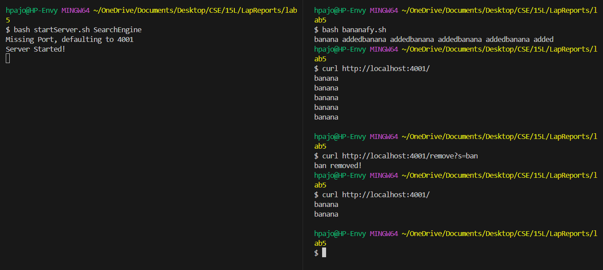
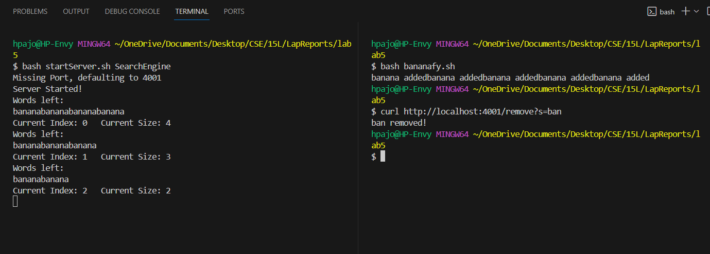
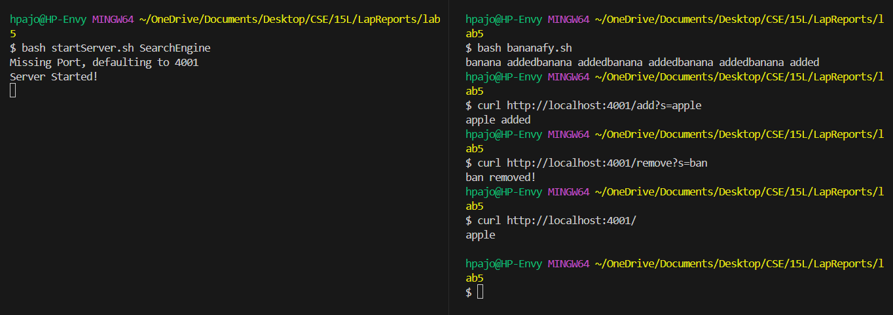

# **Lab Report 5**

## Part 1 – Debugging Scenario

### 1. Words not displaying on server  ```#429```

Hi, 

I am starting up a server I made to add and remove words to a list but when I run I try to remove a word, it only removes some of the instances of 
those words that contain the query. I am starting up the server with a bash script (idk if this would be a problem) and most of the code is copied 
from the number server we had during lab. The rest of the commands work, I just cannot remove properly. The script bananify.sh just adds 5 bananas to the list.



Thank you for any help,
[Student]

----------------------------------------------------------------------------------------------------------------------------------------

### 2. TA Response

Hi [Student],

Thanks for reaching out. Can you try checking how your remove part of your functions works. If you have a loop, maybe try printing out all the words stored or check your index values such as incrementing ```i``` too many times or ending the loop early. Keep in mind that removing a word will alter the size of your arraylist.

Let me know if that helps or if you need further assistance.

Best,
[TA]

----------------------------------------------------------------------------------------------------------------------------------------

### 3. Output from Feedback



Bug: The bug seems to be that within my loop, I was comparing ```i``` to ```word.size()``` without taking into account that ```word.size()``` would actively be changing throughout the loop's iterations everytime an element was removed. Therefore, later instances of the desired element would appear to be skipped over when instead, they would never be reached.

----------------------------------------------------------------------------------------------------------------------------------------

### 4. Information Combo

#### File and Directory Structure

Working Directory: ```/c/Users/hpajo/OneDrive/Documents/Desktop/CSE/15L/LapReports/lab5```
Directory Structure:
```
- lab5
  - bananafy.sh
  - Handler.class
  - NumberEngine.class
  - NumberEngine.java
  - SearchEngine.class
  - SearchEngine.java
  - Server.class
  - Server.java
  - ServerHttpHandler.class
  - startServer.sh
  - URLHandler.class
```

#### Contents of each Relevant File

bananafy.sh:
```
for i in {1..5}; do
    curl http://localhost:4001/add?s=banana &
done
```

SearchEngine.java:
```
import java.io.IOException;
import java.net.URI;
import java.util.*;

class Handler implements URLHandler {
    // The one bit of state on the server: a number that will be manipulated by
    // various requests.
    int num = 0;
    ArrayList<String> word = new ArrayList<String>();

    public String handleRequest(URI url) {
        if (url.getPath().equals("/")) {
            String words = "";
            for(int i = 0; i < word.size(); i++){
                words += word.get(i);
                words += "\n";
            }
            return words;
        } else if (url.getPath().equals("/search")) {
            String s = "";
            String words = "";
            String[] parameters = url.getQuery().split("=");
            if (parameters[0].equals("s")) {
                s = parameters[1];
            }
            for(int i = 0; i < word.size(); i++){
                if(word.get(i).contains(s)){
                    words += word.get(i);
                    words += "\n";
                }
            }
            return words;
        } else if (url.getPath().equals("/remove")) {
            String s = ""; 
            String[] parameters = url.getQuery().split("=");
            if (parameters[0].equals("s")) {
                s = parameters[1];
            }
            for(int i = 0; i < word.size(); i++){
                if(word.get(i).contains(s)) word.remove(i);
            }
            return s + " removed!";
        } else {
            if (url.getPath().contains("/add")) {
                String[] parameters = url.getQuery().split("=");
                if (parameters[0].equals("s")) {
                    String s = parameters[1];
                    word.add(s);
                    return s + " added";
                }
            }
            return "404 Not Found!";
        }
    }
}

class SearchEngine {
    public static void main(String[] args) throws IOException {
        if(args.length == 0){
            System.out.println("Missing port number! Try any number between 1024 to 49151");
            return;
        }

        int port = Integer.parseInt(args[0]);

        Server.start(port, new Handler());
    }
}
```

Server.java:
```
// A simple web server using Java's built-in HttpServer

// Examples from https://dzone.com/articles/simple-http-server-in-java were useful references

import java.io.IOException;
import java.io.OutputStream;
import java.net.InetSocketAddress;
import java.net.URI;

import com.sun.net.httpserver.HttpExchange;
import com.sun.net.httpserver.HttpHandler;
import com.sun.net.httpserver.HttpServer;

interface URLHandler {
    String handleRequest(URI url);
}

class ServerHttpHandler implements HttpHandler {
    URLHandler handler;
    ServerHttpHandler(URLHandler handler) {
      this.handler = handler;
    }
    public void handle(final HttpExchange exchange) throws IOException {
        // form return body after being handled by program
        try {
            String ret = handler.handleRequest(exchange.getRequestURI());
            // form the return string and write it on the browser
            exchange.sendResponseHeaders(200, ret.getBytes().length);
            OutputStream os = exchange.getResponseBody();
            os.write(ret.getBytes());
            os.close();
        } catch(Exception e) {
            String response = e.toString();
            exchange.sendResponseHeaders(500, response.getBytes().length);
            OutputStream os = exchange.getResponseBody();
            os.write(response.getBytes());
            os.close();
        }
    }
}

public class Server {
    public static void start(int port, URLHandler handler) throws IOException {
        HttpServer server = HttpServer.create(new InetSocketAddress(port), 0);

        //create request entrypoint
        server.createContext("/", new ServerHttpHandler(handler));

        //start the server
        server.start();
        System.out.println("Server Started!");
    }
}
```

startServer.sh:
```
javac *.java

if [[ $? -ne 0 ]]; then
    echo "Failed to compile"
    exit 1
fi

TYPE=$1
PORT=$2

if [[ -z "$TYPE" ]]; then
    echo "Missing Type of Server"
    exit 1
fi

if [[ -z "$PORT" ]]; then
    echo "Missing Port, defaulting to 4001"
    PORT="4001"
fi

java "$TYPE" "$PORT"
```

### Trigger and Observe Bug

Lines added to SearchEngine to trigger and observe bug:

```
else if (url.getPath().equals("/remove")) {
    String s = ""; 
    String[] parameters = url.getQuery().split("=");
    if (parameters[0].equals("s")) {
        s = parameters[1];
    }
    for(int i = 0; i < word.size(); i++){
        if(word.get(i).contains(s)) word.remove(i);
        System.out.println("Words left: ");
        for(int j = 0; j < word.size(); j++) System.out.print(word.get(j));
        System.out.println("");
        System.out.println("Current Index: " + i + "   Current Size: " + word.size());

    }
    return s + " removed!";
}
```

> Adding these lines lets you more closely monitor the behavior. Since the server is started, jdb becomes a little more difficult and time consuming then just vissually observing the changes with print lines and the terminals side by side.

#### How To Fix!

It is as simple as storing the total size of our array before removing an item and then run the loop comparing to that or subtracting 1 from ```i``` every time we remove.

Fixed Code:
```
else if (url.getPath().equals("/remove")) {
    String s = ""; 
    String[] parameters = url.getQuery().split("=");
    if (parameters[0].equals("s")) {
        s = parameters[1];
    }
    for(int i = 0; i < word.size(); i++){
        if(word.get(i).contains(s)){
          word.remove(i);
          i--;
        }
    }
    return s + " removed!";
}
```

Proof of fixed behavior:




